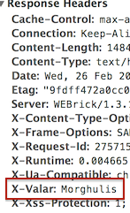

EasterHeaders
============
__Add easter-egg HTTP headers to your Rails app with ease!__

This gem allows you to add a (potentially harmless :)) HTTP header to every response, as an easter egg.

Usage
---
First, add the gem to you `Gemfile`:

````
gem "easter_headers"
````

Then, create an initializer (`config/initializers/easter_headers.rb`, for example), and initialize the values you want there:

````
EasterHeaders::init('X-Dog', 'Marti')
````

You're done:





